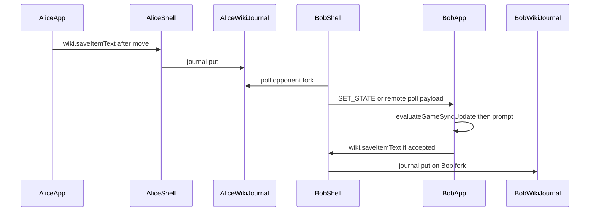

# Guided Tour — Federated Wiki Chess Plugin

This document walks through the chess plugin the way a patient mentor would: starting from _why_ Federated Wiki changes the design, then following a move from the board to the journal, across wikis, and back again. Keep this file open beside the source — every major claim links to a specific line in the codebase so you can jump straight to the implementation.

**Audience:** developers who know JavaScript and the web platform but may be new to Federated Wiki or to chess-on-the-web patterns.

**Companion docs:** user-facing keywords and setup live in [ReadMe.md](./ReadMe.md). The module index and pillar map live in [src/README.md](./src/README.md).

---

## Table of contents

Jump to the first explanation of each major subsystem. Chapters are numbered; Chapter 8 is split by topic because ratings, surveys, leaderboards, and audits share one module (`federation.js`) but deserve separate mental models.

### Foundations

| Subsystem                                          | Start here                                                          |
| -------------------------------------------------- | ------------------------------------------------------------------- |
| Federation philosophy (journal as source of truth) | [Chapter 0](#chapter-0--why-federation-changes-everything)          |
| Three runtimes (shell, app, server)                | [Chapter 1](#chapter-1--three-runtimes)                             |
| Boot paths (embed, popup, PWA)                     | [Chapter 2](#chapter-2--boot-paths-embed-popup-and-pwa)             |
| postMessage contract (`MSG`, `wiki.*`)             | [Chapter 3](#chapter-3--the-postmessage-contract)                   |
| Item text & keywords                               | [Chapter 4](#chapter-4--item-text-lifecycle)                        |
| Journal gateway (save funnel)                      | [Chapter 5](#chapter-5--journal-gateway)                            |
| Game sync (pure policy vs coordinator)             | [Chapter 6](#chapter-6--game-sync-pure-policy-vs-coordinator-state) |
| Remote play & WebRTC                               | [Chapter 7](#chapter-7--remote-play-and-webrtc)                     |

### Ratings, surveys & leaderboards [Chapter 8](#chapter-8--federation-and-ratings)

| Subsystem                               | Start here                                                                 |
| --------------------------------------- | -------------------------------------------------------------------------- |
| **Glicko-2 rating system**              | [Glicko-2 rating system](#glicko-2-rating-system)                          |
| **Surveys & My Chess Games**            | [Surveys & My Chess Games](#surveys--my-chess-games)                       |
| **Twin verification & audits**          | [Twin verification and audits](#twin-verification-and-audits)              |
| **Leaderboards & federation consensus** | [Leaderboards & federation consensus](#leaderboards--federation-consensus) |
| **Open challenges**                     | [Open challenges](#open-challenges)                                        |

### Other surfaces

| Subsystem                        | Start here                                                  |
| -------------------------------- | ----------------------------------------------------------- |
| PWA bridge & local-only sessions | [Chapter 9](#chapter-9--pwa-bridge-and-local-only-sessions) |
| Puzzles                          | [Chapter 10](#chapter-10--puzzles)                          |
| Module map, build & tests        | [Chapter 11](#chapter-11--module-map-build-and-tests)       |

---

## Chapter 0 — Why federation changes everything

### Pages, items, and the journal

Federated Wiki stores content as **pages**. Each page has a **story** made of **items** — small typed blocks (paragraph, code, chess, and so on). When you edit a page, wiki does not overwrite history; it appends a **journal** entry that records what changed. That journal is the audit trail and, for chess, the persistence layer for moves.

A chess item's `text` field holds PGN, FEN, or a **mode keyword** (`GAME`, `POSITION`, `PUZZLE`, `CHOOSE`, `SURVEY`, `LEADERBOARD`). The keyword chooses which experience the iframe loads. See the keyword table in [ReadMe.md: item text quick reference](./ReadMe.md#L121).

### Why there is no central chess server

In a typical chess site, one database holds every game. Here, each wiki is independent. Players fork each other's pages to their own sites. A game may exist as reconciling copies on two hosts. Ratings are discovered by **crawling** federation pages, not by querying a single API.

That decentralization drives almost every architectural choice in this plugin:

- The **shell** (wiki page embed) owns cross-wiki HTTP fetch and journal writes — the app inside the iframe cannot safely assume it can reach arbitrary hosts.
- **Glicko-2** rating system (not flat Elo) handles sparse, irregular games between strangers who may never share a server.
- **Twin verification** for leaderboards requires the same rated result to appear on both players' wikis before it counts.
- **Game sync** must tolerate stale polls, partial forks, and users editing the same item in the wiki story while the board is open.

If you remember one sentence: **journal item text is the source of truth; everything else is a view that must reconcile with it.**

### A concrete example: making a move

Imagine Alice and Bob play across two wikis. Alice's page holds the chess item; her iframe app shows the board. When Alice moves her knight:

1. The **app** updates its in-memory PGN and chess-console state immediately (responsiveness).
2. The app sends `wiki.saveItemText` through postMessage — it does **not** write the journal itself.
3. The **shell** receives the message, runs [applyChessJournalSave](./src/chess.js#L1752), plans journal actions via `buildChessSaveActions` in [chess-core.js](./src/chess-core.js), and commits to Alice's page journal.
4. Bob's wiki fork may lag. His app **polls** Alice's fork (shell fetch) until a new move appears, then [handleRemoteOpponentState](./src/realtime.js#L1041) validates and prompts Bob to accept.

At no point does a central server arbitrate the move. Both sides eventually converge because journal history on each wiki is inspectable and forkable. That is the Federated Wiki way — and it is why the plugin has separate shell and app runtimes instead of one all-in-one SPA.

### PGN tags that matter for federation

Standard PGN tags (`White`, `Black`, `Site`, `Result`, …) are not decorative here. They encode **identity across hosts**:

- Player tags store wiki **domain** as the canonical id (`host (display name)` in PGN); the UI shows **display name first**, domain secondary ([formatPlayerDisplayLabel](./src/chess-core.js#L2958), [playerWikiSiteLinkHtml](./src/chess-core.js#L3540)) — same order as My Chess Games rows.
- The `Site` tag records which host created the game and which item id started it.

Parsing and normalization live in [chess-core.js: §2 PGN/FEN parsing & player identity](./src/chess-core.js#L163). When debugging "wrong player showed up," start with the tags in item text, not the UI labels.

---

## Chapter 1 — Three runtimes

The plugin is not one program — it is **three runtimes** sharing pure libraries. Confusing which runtime owns a responsibility is the most common source of bugs for new contributors.

```
Wiki page (shell)                 iframe / popup / PWA (app)
┌─────────────────┐                 ┌──────────────────────────────────────────┐
│ src/chess.js    │  ─ postMessage ►│ src/chess-app.js (orchestrator)          │
│ iframe, journal │ ◄────────────── │  + game, survey, leaderboard, puzzle, choose-menu, position  │
│ cross-wiki crawl│                 │  + board-layout (transport, PWA chrome)  │
└────────┬────────┘                 │  + realtime (sync, WebRTC)               │
         │                          │  + cm-modules-bundle (board UI)          │
         │ glicko-worker.js         └──────────────────────────────────────────┘
         ▼
Wiki server (optional)
┌─────────────────────────────┐
│ server/puzzle-server.js     │  farm puzzle DB + STUN config
│ server/pwa-bridge.js        │  installed-PWA HTTP bridge (journal, crawl)
└─────────────────────────────┘
```

(This diagram also appears in [ReadMe.md: How the code fits together](./ReadMe.md#L86).)

### Runtime 1 — Wiki shell (`chess.js`)

The shell plugin runs inside the Federated Wiki page. Its file header lists four subsystems ([chess.js: §1–§4](./src/chess.js#L1)):

1. **Plugin emit/bind/editor** — renders the chess item, creates the iframe, handles factory editor and ghost pages.
2. **Journal save gateway** — every persisted item-text change funnels through `applyChessJournalSave` ([chess.js: applyChessJournalSave](./src/chess.js#L1752)).
3. **Cross-wiki crawl** — ratings, leaderboard, and challenge discovery; the app asks, the shell fetches.
4. **postMessage shell handlers** — `shellAppMessageHandlers` ([chess.js: handlers table](./src/chess.js#L4060)).

The shell bundle is built to `client/chess.js`. It **never** imports `cm-modules-bundle.js` (the heavy board UI). That keeps wiki pages lean.

**Shell-only rule:** all cross-wiki HTTP goes through `createBrowserWikiSiteClient` in [federation.js](./src/federation.js#L5557). The app sends semantic requests (`wiki.buildLeaderboard`, etc.); the shell performs the fetch.

### Runtime 2 — Chess app (`chess-app.js` + submodules)

The app loads in:

- the wiki iframe embed,
- a popup window,
- an installed Progressive Web App (PWA),
- or directly at `/plugins/chess/` for development.

Its header ([chess-app.js: §1–§5](./src/chess-app.js#L1)) describes boot, PWA session orchestration, auth lock, journal gateway helpers, and app-side postMessage handlers.

`chess-app.js` is the **orchestrator**. It imports submodules but owns:

- boot routing via `initializeChessCore` ([chess-app.js: initializeChessCore](./src/chess-app.js)),
- the enriched `postToShell` function and wiring of `createShellMessenger` ([board-layout.js: createShellMessenger](./src/board-layout.js#L3240)),
- auth / viewer context, PWA session orchestration, and journal gateway helpers,
- init hosts that pass live getters into `game.js`, `survey.js`, `puzzle.js`, and other submodules.

GAME-mode board UI (console, player bars, start-game modal, challenges, resign, comments) lives in [game.js](./src/game.js).

Submodules (`game.js`, `survey.js`, `leaderboard.js`, `puzzle.js`, `choose-menu.js`, `position.js`, `board-layout.js`, `realtime.js`) must **not** call raw `postToShell({ action: MSG.* })`. They use `shellMessengerFromContext(ctx)` instead ([board-layout.js: shellMessengerFromContext](./src/board-layout.js#L3221)).

Newer app→shell families (still via `wiki.*` / the shell messenger — never raw `MSG` in submodules):

- [`MSG.SHOW_CRAWL_HITS_PAGE`](./src/chess-core.js#L5008) — open a ghost page of federation crawl site/game hits as Federated Wiki reference items
- [`MSG.ALERT_UI`](./src/chess-core.js#L5019) — full-viewport OK alert on the parent wiki window (iframe embeds that cannot reliably own top-level dialogs)
- [`MSG.FETCH_LOCAL_ACADEMY_PROGRESS`](./src/chess-core.js#L5027) / [`MSG.LOCAL_ACADEMY_PROGRESS_DATA`](./src/chess-core.js#L5046) — request/response pair that reads per-slug academy progress from local wiki pages

### Runtime 3 — Wiki server plugins

Two optional server modules extend the farm:

| Module                                               | Role                                                                                                              |
| ---------------------------------------------------- | ----------------------------------------------------------------------------------------------------------------- |
| [server/puzzle-server.js](./server/puzzle-server.js) | Shared Lichess puzzle database on disk; `/plugin/chess/puzzle` draw API                                           |
| [server/pwa-bridge.js](./server/pwa-bridge.js)       | Same-origin HTTP bridge when there is no wiki iframe/opener (installed PWA + direct `/plugins/chess/` tab) ([pwa-bridge.js: header](./server/pwa-bridge.js#L1)) |

The PWA bridge exposes a Node counterpart to the browser site client: `createPwaBridgeSiteClient` vs `createBrowserWikiSiteClient`. Same reducer and journal semantics; different transport.

### Shared pure libraries

Two modules are **shared** (inlined into both bundles, no DOM):

| Module                               | Responsibility                                                                                       |
| ------------------------------------ | ---------------------------------------------------------------------------------------------------- |
| [chess-core.js](./src/chess-core.js) | Item/PGN/FEN parsing, keywords, autosave guards, session FSM, pure game-sync policy, `MSG` constants |
| [federation.js](./src/federation.js) | Glicko-2, federation crawl/consensus, and charm/gossip page operations                               |

Everything that can be pure stays here so `npm test` can cover it without a browser.

### Submodule responsibilities (app side)

Beyond the orchestrator, each submodule has a narrow contract:

| Submodule                                | Owns                                                                             | Must not own                                         |
| ---------------------------------------- | -------------------------------------------------------------------------------- | ---------------------------------------------------- |
| [game.js](./src/game.js)                 | GAME console, seats, start-game modal, player bars, challenges, resign, comments | boot router, journal gateway, auth/PWA orchestration |
| [choose-menu.js](./src/choose-menu.js)   | CHOOSE menu, mode entry, resume/cancel                                           | journal puts, cross-wiki fetch                       |
| [position.js](./src/position.js)         | POSITION FEN editor board, save/flip, mode entry                                 | start-game modal (game.js), puzzle authoring         |
| [puzzle.js](./src/puzzle.js)             | PUZZLE solver, CSV parse, offline DB                                             | raw postMessage                                      |
| [survey.js](./src/survey.js)             | IndexedDB ratings, site-survey / challenges, shared browse shell                 | Glicko math (import from federation.js)              |
| [leaderboard.js](./src/leaderboard.js)   | Federated leaderboard gate, hop dials, ranking table                             | crawl / IndexedDB ownership (survey + federation)    |
| [board-layout.js](./src/board-layout.js) | layout, paste, PWA chrome, wiki transport                                        | game rules, PGN parsing                              |
| [realtime.js](./src/realtime.js)         | sync epoch, remote poll, WebRTC                                                  | journal planning                                     |
| [modals.js](./src/modals.js)             | dialog stack, mount restore                                                      | business rules                                       |

When you are unsure where code belongs, ask: **does this need DOM?** If no → chess-core or federation. If yes → app submodule. If it touches another wiki → shell.

### cm-modules-bundle — the board runtime

[cm-modules-bundle.js](./src/cm-modules-bundle.js) is the esbuild entry that bundles chess-console, cm-chessboard, Stockfish glue, and Staunty piece sprites. chess-app imports it at runtime; the shell never loads it. Upstream cm-\* packages are npm dependencies — never edit `node_modules/`; patch via the bundle entry and rebuild with `node --no-warnings scripts/build-client.js --cm-bundle-only` (or full `npm run build`).

---

## Chapter 2 — Boot paths: embed, popup, and PWA

### Why boot is complicated

The same `chess-app.js` bundle runs in four contexts. Each context differs in:

- whether a wiki **parent window** exists (`postMessage` vs HTTP bridge),
- whether the user is **signed in** to the wiki,
- whether the surface is an **embed** (small iframe), **popup** (larger window), or **standalone PWA**.

Getting boot wrong produces blank boards, double initialization, or focus stolen from an open wiki text editor.

### Document ready in an iframe

Wiki may inject the iframe **after** `DOMContentLoaded` on the parent page. The app therefore uses `whenDocumentReady` ([chess-app.js: whenDocumentReady](./src/chess-app.js#L2598)) instead of assuming the event already fired.

### Boot intent resolution

[board-layout.js: resolveBootIntent](./src/board-layout.js#L2692) classifies the launch surface from three booleans: `hasWikiFrame`, `isWikiPopup`, `isPwaStandalone`. That classification drives layout caps, chrome visibility, and transport selection.

### PWA boot sequence

When the user installs the chess app from the popup, [chess-app.js: bootInstalledPwa](./src/chess-app.js#L2877) orchestrates the standalone path and always clears the boot splash ([hideAppLoadingScreen](./src/chess-app.js#L3222)) in a `finally` so a failed bridge step cannot hang on “Loading…”. Session restore / menu entry then goes through [board-layout.js: bootPwa](./src/board-layout.js#L2770):

- service worker registration via [registerChessServiceWorker](./src/board-layout.js#L189),
- page title chrome (`initPwaPageChrome` in board-layout §4),
- bridge activation when there is no wiki parent.

PWA protocol constants (`PWA_BRIDGE_BASE`, `matchInstalledChessPwa`, `ensurePwaProtocol`) live in [board-layout.js §4](./src/board-layout.js#L25) — guarded as SSOT by [architecture-guards.test.js](./test/architecture-guards.test.js#L83).

### Session FSM

Once boot completes, the app tracks lifecycle in a finite-state machine defined in [chess-core.js: SESSION_PHASE](./src/chess-core.js#L4484) and [reduceChessSession](./src/chess-core.js#L4531). Phases include `boot`, `setup` (bare keyword menus), and `active` (board running).

The session holds the live chess object, view routing, popup-follow flag, and setup dismiss state. **There is no separate global chess state** — comments in chess-app emphasize that `chessSession` is the sole source of truth.

### Shell context key

The shell indexes live embed state by `${pageKey}/${item.id}` — not item id alone. Two items on different pages could share an id after forks; the composite key prevents cross-talk.

---

## Chapter 3 — The postMessage contract

### Same origin only

Shell and app communicate via `window.postMessage`. Action names are frozen constants in [chess-core.js: MSG](./src/chess-core.js#L4976). Both sides check origin (`window.origin`) before handling messages.

Think of `MSG` as the **wire protocol**. Adding a new cross-window capability starts here with a new constant and handlers on both sides.

### Two directions

| Direction   | Handler table             | Module                                   |
| ----------- | ------------------------- | ---------------------------------------- |
| App → shell | `shellAppMessageHandlers` | [chess.js](./src/chess.js#L4060)         |
| Shell → app | `appShellMessageHandlers` | [chess-app.js](./src/chess-app.js#L2735) |

Dispatch uses a shared lookup-table pattern (`createMessageDispatcher`). Shell → app delivery enters through [board-layout.js: initInboundShellMessageBridge](./src/board-layout.js#L3098).

### Why submodules must not raw-post

Early versions let any file call raw `postToShell({ action: MSG.SAVE_ITEM_TEXT, ... })`. That scattered transport concerns and made enrichment (adding page keys, item ids, and popup-follow state) easy to forget.

The fix is layered:

1. **Orchestrator only:** `chess-app.js` builds an enriched `postToShell`, then `createShellMessenger(postToShell)` in [board-layout.js](./src/board-layout.js#L3223) wraps it with typed methods (`wiki.saveItemText`, `wiki.buildLeaderboard`, …). The messenger object is still named `wiki` in the app for call-site ergonomics.
2. **Submodules:** call `shellMessengerFromContext(ctx)` ([board-layout.js](./src/board-layout.js#L3113)) to get the messenger from render context.
3. **Dispatch:** `sendTransport` / `enrichTransport` ([board-layout.js: sendTransport](./src/board-layout.js#L3113)) attach metadata before the message crosses the iframe boundary. The same helpers power `shellTransport` ([board-layout.js: shellTransport](./src/board-layout.js#L3245)) — a ready-made API object for call sites that do not already hold a messenger instance.

If you add a feature that needs shell cooperation, add a `MSG` constant, a shell handler, an app handler (if replies are needed), and a `wiki.*` helper — in that order.

### Sync-only GET_STATE

When the wiki user is editing item text, a full iframe re-init would steal focus. [chess-core.js: shouldRespondWithPatchStateOnly](./src/chess-core.js#L4478) tells the shell to reply with a lightweight sync instead of rebooting the app.

### Popup relay

The popup window and the wiki iframe can both show the same game. That is **popup/iframe handoff**, not Federated Wiki page mirroring (twins/forks). Three related flags keep the layers straight:

1. **`popupActive`** (shell `itemLive` in [chess.js](./src/chess.js)) — a popup is open; journal saves from the iframe surface are blocked.
2. **`followPopup`** — boolean carried on `SET_STATE` / `slimAppState` so each surface knows whether it is the follower.
3. **`followsPopup`** (app `ctx` getter) — how the embed reads that follower state after the message arrives.

Certain user actions (`REQUEST_RESIGN`, `REQUEST_SWITCH_GAME_MODE`, `REQUEST_OPEN_POSITION_EDITOR`) relay between iframe and popup so either surface can drive the same game when the popup is active. See [ReadMe.md: popup-follower routes](./ReadMe.md#L117).

---

## Chapter 4 — Item text lifecycle

### Keywords vs content

[chess-core.js: §1 Format detection & keywords](./src/chess-core.js#L55) parses the first token of item text. A bare keyword (`GAME` with no PGN yet) means "show setup UI, do not treat as an in-progress game."

[isBareModeKeyword](./src/chess-core.js#L1362) identifies keywords that imply mode selection rather than position data.

### The autosave guard (non-negotiable)

On page load, the app initializes from item text. If bare keywords wrote back to the journal immediately, merely **viewing** a page would mutate history — an unacceptable surprise on a wiki.

[shouldIgnoreKeywordAutosave](./src/chess-core.js#L1415) returns true when:

- text is empty or exactly the keyword alone, or
- keyword is `GAME` and the position is still an ephemeral open-seat board ([isUnseatedFreshGamePgn](./src/chess-core.js#L1369) — both seats open, no moves yet).

Once a player claims a seat or makes a move, persistence must proceed so reload survives. The comment in `shouldIgnoreKeywordAutosave` explains the subtle `GAME` exception.

[shouldPersistChessItemText](./src/chess-core.js#L1429) is the shared gate used by shell, PWA bridge, and server save paths.

### Ghost items and open seats

Federated games often start as **ghost pages** — forkable placeholders until both players sit down. Helpers like [keepGhostUntilSeatsFilled](./src/chess-core.js#L1411) keep lineup ghosts visible until both seats fill.

When journal put finally happens, [mapChessSaveActionsForJournal](./src/chess-core.js#L1471) (with `stripGhost`) runs [stripCreatePreviewFlag](./src/chess-core.js#L1441) so transient create-preview / ghost flags do not enter history.

### Paste capture

Pasting PGN or FEN onto the board triggers a confirm modal. Paste logic is split: payload builders in chess-core, modal in modals.js, capture wiring in board-layout §3.

### CHOOSE and bare GAME flows

An empty chess item or bare `CHOOSE` keyword shows the start menu ([choose-menu.js](./src/choose-menu.js)). Choosing "Play New Game" or landing on bare `GAME` enters **setup** session phase ([SESSION_PHASE.SETUP](./src/chess-core.js#L4484)) until the user picks opponents, colors, and settings.

[game.js: New-game setup](./src/game.js#L182) (`initGame`, `wirePositionEditor`) wires the shared start-game modal. Only after setup completes does the app transition to `ACTIVE` and begin autosave-eligible persistence.

### Factory editor vs live board

Wiki's factory editor lets authors type raw item text. The shell must distinguish **authoring** (text edit in progress) from **playing** (iframe active). [shouldRespondWithPatchStateOnly](./src/chess-core.js#L4478) prevents iframe reload during text edit — a common federated wiki UX requirement that chess must respect.

---

## Chapter 5 — Journal gateway

### End-to-end save funnel

When the app saves a move or position, the path is:

```
app wiki.saveItemText(...)
  → postMessage MSG.*
  → shell handler
  → applyChessJournalSave (chess.js)
  → buildChessSaveActions (chess-core.js)
  → applyPageAction / journal put
```

### Shell entry: applyChessJournalSave

[chess.js: applyChessJournalSave](./src/chess.js#L1752) is the **only** shell path for item-text persistence. It:

- rejects saves on inappropriate ghost pages,
- calls `buildChessSaveActions` with the current page snapshot,
- maps actions through `mapChessSaveActionsForJournal` when ghost stripping is needed,
- applies journal puts via wiki's page API.

Architecture tests assert the shell routes through this gateway ([architecture-guards.test.js](./test/architecture-guards.test.js#L155)).

### Reducer: buildChessSaveActions

`buildChessSaveActions` in [chess-core.js](./src/chess-core.js) turns "(page, itemId, nextText)" into zero or more ordinary journal actions, including split correspondence plies and ghost materialization edits. It is the **planning** step; `applyPageAction` beside it is the pure reducer that applies one action to an in-memory page clone. Federation charm/gossip mutations stay in [federation.js](./src/federation.js) and write `page.chess` rather than ordinary journal entries.

Keeping planning and reduction in chess-core.js (not chess.js) lets the PWA bridge reuse the same semantics without duplicating journal rules.

### Survey item guard

`SURVEY` and `LEADERBOARD` items are special: their visible text stays a bare keyword while rich state lives in `page.chess` metadata and IndexedDB. Saves that would overwrite survey item text inappropriately are blocked ([shouldPersistChessItemText](./src/chess-core.js#L1429) checks `isSurveyItemText`).

### Tracing a save in the debugger

Set breakpoints in this order when a save "does nothing":

1. App: the `wiki.saveItemText` call (search `saveItemText` in chess-app / submodules).
2. Shell: matching handler in [shellAppMessageHandlers](./src/chess.js#L4212) — did the message arrive?
3. [applyChessJournalSave](./src/chess.js#L1752) early returns — ghost page? survey guard? empty text?
4. `buildChessSaveActions` in [chess-core.js](./src/chess-core.js) — did it produce zero actions (keyword guard)?
5. Wiki page API — did the journal put throw?

Most "move didn't save" reports are keyword autosave guards firing correctly on open-seat boards, or ghost-page guards blocking premature materialization.

Federation gossip (`checkpoint`, `trustedPeers`) is written directly to `page.chess` — not in visible story blocks.

### Worked example: one move to journal

Follow a typical in-game move from board to history:

1. **Local move.** The chess-console fires a move handler in [chess-app.js](./src/chess-app.js). The app updates in-memory PGN and bumps the sync epoch in [realtime.js](./src/realtime.js#L65).

2. **Transport.** The handler calls `wiki.saveItemText(nextPgn)` from the messenger created by [createShellMessenger](./src/board-layout.js#L3240). `sendTransport` enriches the payload with page key, item id, and popup-follow state ([board-layout.js: sendTransport](./src/board-layout.js#L3113)).

3. **Shell receive.** A matching entry in [shellAppMessageHandlers](./src/chess.js#L4212) dispatches to [saveItemText](./src/chess.js#L1831), which is a thin wrapper around [applyChessJournalSave](./src/chess.js#L1752).

4. **Plan actions.** Inside `applyChessJournalSave`, the shell reads the live page snapshot (`$page.data('data')`) and calls `buildChessSaveActions` in [chess-core.js](./src/chess-core.js) with `(page, itemId, nextText, { fen, prevText })`.

5. **Ghost handling.** If this save materializes a ghost page (first seated open game, paste ghost, challenge join), `resolveMaterializeAction` may prepend a materialize action. [mapChessSaveActionsForJournal](./src/chess-core.js#L1471) strips ghost flags before put when appropriate ([chess.js: applyChessJournalSave body](./src/chess.js#L1752)).

6. **Journal put.** `putChessPageActionsInOrder` applies actions through wiki's page API. The story item text and any `page.chess` side-effects update atomically in journal order.

The PWA bridge path replaces steps 2–3 with HTTP `PUT /save-game` ([pwa-bridge.js: save-game route](./server/pwa-bridge.js#L911)) but steps 4–6 reuse the same reducer — that reuse is intentional.

### Ghost materialization timing

Not every save is a simple item-text edit:

| Scenario                | Typical trigger                                                      | Materialize?                         |
| ----------------------- | -------------------------------------------------------------------- | ------------------------------------ |
| Move in seated game     | `saveItemText`                                                       | No — in-place edit                   |
| First seat in open game | `saveSeatedOpenGameJournal` ([chess.js:L1846](./src/chess.js#L1846)) | Yes — ghost page → real page         |
| Paste as new item       | paste ghost flow                                                     | Yes                                  |
| Accept open challenge   | challenge join ghost                                                 | Yes — join finalize before/after put |

Premature materialization would fork a page before the player confirms settings; guards in `applyChessJournalSave` and ghost-page checks prevent that.

---

## Chapter 6 — Game sync: pure policy vs coordinator state

Remote play introduces a classic distributed-systems problem: **two boards, one authoritative journal, delayed observation.**

The plugin splits the solution deliberately.

### Pure policy — evaluateGameSyncUpdate

[chess-core.js: evaluateGameSyncUpdate](./src/chess-core.js#L4923) answers one question: "May this incoming PGN apply to the local board right now?" It knows about:

- ply counts and stale remote updates,
- whether a local apply is in progress,
- whether the update came from a local move, shell SET_STATE, or remote poll.

It does **not** hold mutable state. Unit tests can exhaust cases without DOM.

The file comment states the split explicitly: policy stays testable; realtime owns state and prompts.

### Coordinator state — realtime.js

[realtime.js](./src/realtime.js#L54) §2 holds the **mutable** sync epoch, apply gate (`beginGameSyncApply` / `endGameSyncApply`), and pending remote prompts.

When the shell polls an opponent's fork and forwards new moves, [handleRemoteOpponentState](./src/realtime.js#L1041) validates continuations and may queue a user prompt before applying.

### Shell SET_STATE — applySyncedPosition

Background reconciliation from the shell uses [realtime.js: applySyncedPosition](./src/realtime.js#L1175) (§5), initialized via `initShellSync` from chess-app. This path must respect the same pure gate — coordinator calls `evaluateGameSyncUpdate` before mutating the console.

### Naming note for readers

Both chess-core §6 and realtime §2 mention "game sync coordinator" in their headers. In documentation terms:

- **chess-core** = policy (the gate),
- **realtime** = coordinator (state + I/O + prompts).

A future refactor might rename one header for clarity; behavior is already separated correctly.

### GAME_SYNC_SOURCE and ply epoch

The pure gate distinguishes **sources** of incoming PGN (local move, shell SET_STATE, remote poll, WebRTC). [resetGameSyncEpoch](./src/realtime.js#L59) and [bumpGameSyncEpoch](./src/realtime.js#L65) track how many plies the app has committed locally so stale polls cannot rewind the board.

When writing tests for sync, prefer testing [evaluateGameSyncUpdate](./src/chess-core.js#L4923) in isolation first — if policy rejects an update, realtime should never apply it.

### User prompts vs silent apply

Not every remote update applies silently. [maybeAutoAcceptPendingRemoteMove](./src/realtime.js#L1108) and game-end counterparts implement product rules: auto-accept when safe, modal when the fork would rewrite local state ambiguously. This is intentional — federation users must consent to importing someone else's line.

### Decision tree: evaluateGameSyncUpdate

When debugging "remote move didn't apply," walk this tree against [evaluateGameSyncUpdate](./src/chess-core.js#L4923):

```
sameItemText?  → accept (reload from own journal)
applying && source ≠ LOCAL_MOVE?  → reject (sync-in-progress)
source = LOCAL_MOVE?  → accept (user just moved)
incomingPly < localPlyEpoch?  → reject (stale-ply)
source = SHELL_SET_STATE && incoming ≥ local?  → accept (shell caught up)
source = REMOTE_* && incoming ≤ local?  → reject (local-ahead)
else  → accept
```

**applySyncedPosition** ([realtime.js:L1205](./src/realtime.js#L1175)) is for shell-initiated SET_STATE — same-origin parent pushing state after embed reload or mirror sync. **handleRemoteOpponentState** ([realtime.js:L1045](./src/realtime.js#L1041)) is for opponent forks discovered by poll or WebRTC. Both call the pure gate first; neither bypasses it.

---

## Chapter 7 — Remote play and WebRTC

### Correspondence by default

Federated Wiki chess assumes **asynchronous** play: each player maintains a fork on their wiki, watches the opponent's page for journal updates, and imports moves when ready. The shell polls opponent hosts; the app validates and prompts.

[realtime.js: §3 Remote poll accept / game-end prompts](./src/realtime.js#L333) covers accept/reject UX when a new move arrives out of band.

### Continuation validation

[validateRemoteContinuation](./src/realtime.js#L150) ensures remote SAN sequences extend local play legally. [classifyRemoteGameEnd](./src/realtime.js#L220) detects when the remote PGN declares a result the local board has not yet accepted.

### WebRTC upgrade

When both players enable auto-fork in game settings and consent to realtime, [realtime.js: §4 WebRTC peer channel](./src/realtime.js#L649) can upgrade from poll-based sync to a direct data channel for lower latency.

WebRTC is an **optimization**, not the source of truth. Journal writes still record every move; disconnecting falls back to polling.

### Presence and signals

[sendRealtimePresence](./src/realtime.js#L396) and signal normalization ([normalizeRealtimeSignalMap](./src/chess-core.js#L4865)) let boards show opponent online state and exchange SDP offers without routing through the wiki server.

### Correspondence loop



Each player owns a **fork** on their wiki. The shell on Bob's browser fetches Alice's public page — the app never calls Alice's host directly. When Bob accepts Alice's move, Bob's journal records the imported line on **his** copy; Alice does not write to Bob's site.

### Fork prompt UX

When [handleRemoteOpponentState](./src/realtime.js#L1041) detects a legal continuation ahead of local ply, the app may show a modal: accept the opponent's move into your fork, or dismiss and keep editing locally. Auto-accept paths ([maybeAutoAcceptPendingRemoteMove](./src/realtime.js#L1108)) apply only when product rules deem the merge safe — e.g. strict continuation with no local uncommitted edits.

Accepting (**Fork Move** or auto-fork) asks the shell to page-fork the opponent's public copy ([forkRemoteOpponentPage](./src/chess.js) via `MSG.FORK_REMOTE_PAGE`). After the journal put succeeds, the shell must assign [mergeItemTextIntoChessObj](./src/chess-core.js)'s return value into `ctx.chessObj` before `SET_STATE` — that helper returns a new object and does not mutate in place. Then [applySyncedPosition](./src/realtime.js) updates the board without a full page refresh.

Game-end detection ([classifyRemoteGameEnd](./src/realtime.js#L220)) follows the same pattern: remote `Result` tag may arrive before the local board shows checkmate.

---

## Chapter 8 — Federation and ratings

Chapter 8 covers the four pillars that share `federation.js` (pure math + crawl) and `survey.js` (IndexedDB + views). Read them in this order if you are new to federation ratings: Glicko-2 → surveys → twin audits → leaderboards → open challenges.

### Glicko-2 rating system

Flat Elo assumes frequent, evenly-matched games against a central pool. Federation games are sparse, irregular, and discovered after the fact. **Glicko-2** tracks three numbers per player:

| Field          | Meaning                                                          |
| -------------- | ---------------------------------------------------------------- |
| `rating` (`r`) | Strength estimate (anchor 1500 = μ 0 on the Glicko-2 scale)      |
| `rd`           | Rating deviation — uncertainty; high RD → provisional `?` marker |
| `sigma` (`σ`)  | Volatility — how erratic results are expected to be              |

Constants and the scale conversion live in [federation.js: §1 Glicko-2](./src/federation.js#L79). The update pipeline is [updateRatingState](./src/federation.js#L330) (batch opponent updates with decay) and [rateGame](./src/federation.js#L410) (one finished human game, both seats).

**Sparse-play decay.** Real time matters: [decayRatingState](./src/federation.js#L275) inflates RD per whole [RATING_PERIOD_MS](./src/federation.js#L116) week of inactivity so long gaps do not over-trust stale numbers.

**Batched timeline replay.** Federation recomputation does not update after every single verified game in isolation. [replayEventsOntoPlayersBatched](./src/federation.js#L4378) groups verified events into Glicko "periods" — a batch closes when [shouldCloseGlickoBatch](./src/federation.js#L4340) sees a seven-day gap or 15 games plus a new calendar day ([GLICKO_BATCH_GAME_LIMIT](./src/federation.js#L119)). Deep recomputation can run off the main thread via [glicko-worker.js](./src/glicko-worker.js).

**Why batching rules matter.** Glicko-2 treats every game inside one batch as occurring _simultaneously_ — one rating period, one simultaneous update per player ([applyGlickoBatchToPlayers](./src/federation.js#L4353)). Closing a batch on game count alone, without the calendar-day guard, would split a single-day streak across multiple batches and artificially collapse Rating Deviation (RD), breaking the ranking math. The 15-game cap therefore only closes a batch when the _next_ event falls on a different UTC calendar day than the last game already in the batch.

**Auditable PGN tags.** A rated game is a self-contained rating event. On finalize, [buildGlickoTags](./src/federation.js#L477) stamps pre-game state into the PGN:

- `[Rated] yes`
- `[WhiteGlickoRating]`, `[WhiteGlickoRD]`, `[WhiteGlickoVolatility]` (and Black counterparts)

[readGlickoState](./src/federation.js#L496) recovers `{ r, RD, σ }` from Glicko tags when crawling peer wikis. Federation math is Glicko-native end to end (`WhiteElo` / `BlackElo` are Stockfish UCI strength only).

**Provisional vs reliable.** [isProvisional](./src/federation.js) is true while RD exceeds [PROVISIONAL_RD](./src/federation.js) (110). [isReliable](./src/federation.js) is the complement; the leaderboard "established only" filter uses it.

**Local finalize path.** When a human rated game ends in the app, [survey.js: finalize path](./src/survey.js) loads IndexedDB state, calls `rateGame`, stamps Glicko tags + completion hashes ([stampCompletionTags](./src/federation.js)), and saves through the journal gateway. Player bars show provisional/unverified hints via [ratingForSeat](./src/survey.js).

**Separate engine track.** Personal vs-Stockfish ratings live under an `:engine` suffix in IndexedDB ([rateEngineGame](./src/federation.js)). They never federate, seed the human prior, or appear on the ranked board.

### Surveys & My Chess Games

The **My Chess Games** page ([pages/my-chess-games](./pages/my-chess-games)) carries a bare `SURVEY` chess item. That keyword alone tells the plugin to open the site survey UI — a lobby for your games, opponents, and open seeks discovered by crawl. The visible item text stays the static keyword; rich metadata attaches to the item and to `page.chess`, not to a growing PGN in the story.

**Game catalog (`page.chess.gameIndex`).** Journal saves (and league seed) upsert each local game into a metadata-only catalog on My Chess Games — refs + content hashes, never full PGNs ([readGameIndex](./src/federation.js#L789), [buildGameIndexEntryFromPgn](./src/federation.js#L822), [upsertGameIndexEntry](./src/federation.js#L890), [applyGameIndexToSurveyPage](./src/federation.js#L917); shell publish in [chess.js](./src/chess.js)). Site and federation game crawls read that catalog instead of sitemap-fanout for games, so discovery stays cheap as a farm grows. If on-disk catalog rows are unreadable (wrong field names), [gameIndexHasUnreadableEntries](./src/federation.js#L702) forces a one-shot sitemap rebuild so Active Games stay honest.

| Concept                             | Where it lives                                                                                               |
| ----------------------------------- | ------------------------------------------------------------------------------------------------------------ |
| Survey keyword & page slug          | [SURVEY_PAGE_SLUG](./src/federation.js#L2946), [SURVEY_PAGE_STORY](./src/federation.js#L3258)                |
| Site game discovery (fast path)     | Shell/PWA crawl via [buildSiteSurveyAsync](./src/federation.js#L6737) (`includeFederationChallenges: false`) |
| Deferred enrich + open challenges   | [orchestrateSiteSurveyDeferredWork](./src/federation.js#L6660) — shared by shell and PWA bridge              |
| Per-site survey view                | [survey.js §3](./src/survey.js#L6) (`viewKind: 'siteSurvey'`)                                                |
| Open-challenge index on page charm  | `page.chess.openChallenges` ([openChallengeSurveyRecord](./src/federation.js#L2811), [syncOpenChallengeSurveyOnPage](./src/federation.js#L5345)) |
| Farm-peer roster (browser)          | wiki-plugin-present [`GET /plugin/present/roll`](./src/federation.js#L3107) → [fetchFarmPeerSites](./src/federation.js#L3117) |

**Opt-in without a keyword.** Publishing any **rated** human game opts the site into federated leaderboards — no separate "join league" keyword is required ([federation.js: SURVEY page comment](./src/federation.js#L634)).

**IndexedDB-primary UI.** [survey.js: header](./src/survey.js#L1) owns the browser-side source of truth for ratings UI: IndexedDB store (`RATING_INDEXED_DB_NAME`), fast sync loop, and in-game finalize. The shell does not hold long-lived rating state; it crawls on demand when the app calls `wiki.buildLeaderboard` or `wiki.crawlUi`.

**Starting rating.** Every new player starts at the neutral prior (`r = 1500`, max RD) via [newRatingState](./src/federation.js). There is no self-estimate UI and no Stockfish/puzzle seeding of the federated rating. If the local store is empty but published rated games exist, discovery adopts that history instead.

**Fast sync loop.** [survey.js](./src/survey.js) runs a periodic soft sync ([FAST_SYNC_INTERVAL_MS](./src/federation.js#L621), five minutes) to refresh the visible-federation view from trusted checkpoints when stale. When checkpoint gossip diverges or no supermajority exists, the engine returns local IndexedDB ratings unchanged and sets `queueAudit: true`; [handleLeaderboardData](./src/survey.js#L1517) then triggers a **background audit** (`deepRecompute: true`, `background: true`) without clearing the board. There is no user-facing audit button — reconciliation is silent.

**Site-survey deferred work.** A site survey paints quickly: the fast path returns local games with `openChallengesPending` / `siteGamesEnrichmentPending`, and keeps the page snapshot in `meta.games`. [beginDeferredSiteSurveyWork](./src/survey.js#L1686) then asks the shell (or PWA bridge) for federation open seeks and twin-enriched games via `wiki.buildChallenges({ forSiteSurvey: true })` and `wiki.enrichSiteSurvey`. Before that request, the **browser** warms local-farm peers with [fetchFarmPeerSites](./src/federation.js#L3117) (present roll) and passes them as `farmPeerSites` on the challenge job — see [Discovery seeds](#open-challenges). Enrich passes the fast-path snapshot as `crawledGames` on `MSG.BUILD_SITE_SURVEY_ENRICH` so [orchestrateSiteSurveyDeferredWork](./src/federation.js#L6660) can skip a second `crawlSiteGamePagesAsync`. Both wiki embed and installed PWA share that orchestrator (shell handler and PWA bridge).

**Local blockList.** Neighborhood filters are surgical and per-node, never gossiped. IndexedDB `meta` holds `blockList` (sites muted from fetch/replay), `deletionMetrics` (deletion-ratio tracking), `island` (graph health), `federationSites` (hosts that answered SURVEY-page probes), and `siteCrawlCache` (per-host sitemap + games snapshot used to skip repeat page fetches — [normalizeSiteCrawlCache](./src/federation.js#L4941)). None of that meta is gossiped. There is no manual mute UI — sites enter `blockList` through silent [deletion-ratio auto-block](#twin-verification-and-audits) ([applyDeletionRatioMetrics](./src/federation.js#L1417)). [federationIndexedDbPayload](./src/survey.js#L290) attaches that meta to neighborhood fetch requests. The wiki shell forwards it into `runNeighborhoodJob`; the installed PWA does the same through [federationIndexedDbOptsFromPayload](./server/pwa-bridge.js#L48) on `/dispatch` and REST leaderboard.

### Twin verification and audits

Cross-wiki games exist as **twins** — the same game forked onto both players' sites as independent PGN records. Because no central server arbitrates results, federation treats ratings like double-entry bookkeeping: a number counts only when both ledgers reconcile.

**Core audit.** [auditTwins](./src/federation.js#L1594) compares local and remote copies:

1. [gameFingerprint](./src/federation.js#L1539) must match (sorted player hosts + game id/event/date).
2. [compareGameRecords](./src/federation.js#L1552) checks move-for-move SAN equality and terminal tags (`Result`, `Termination`).
3. [replayLegal](./src/federation.js#L1581) validates both records with cm-pgn.

A one-sided publish (twin not crawled yet) fails closed — `verified: false`, reason `no twin / one-sided`.

**Verified timeline.** [collectVerifiedTimelineEvents](./src/federation.js#L4297) walks a crawled game pool, keeps only rated finished games with a reconciling twin ([hasVerifiedTwin](./src/federation.js#L4224)), drops sites via [isSiteBlocked](./src/federation.js#L1345) / local `blockList` (surgical filter — not gossiped), and sorts by [readGameTimelineKey](./src/federation.js#L1229) (`TerminationTimestamp` + `GameHash`). That ordered event list feeds Glicko replay and checkpoint cursors.

**Missing-twin soft audit.** When a peer site is up but the expected twin PGN is absent, [detectMissingTwinFinding](./src/federation.js#L1627) records a `missing-twin` finding. Owners can also stamp an explicit `PeerMissing` tag ([readPeerMissingPgnTag](./src/chess-core.js#L2969)). [collectMissingTwinFindings](./src/federation.js#L1663) and [missingTwinFindingsFromPool](./src/federation.js#L1704) aggregate these across crawls.

**Deletion-ratio auto-block.** Repeated missing twins on _local losses_ feed [applyDeletionRatioMetrics](./src/federation.js#L1417). When the ratio of missing twins to expected losses exceeds [DELETION_RATIO_THRESHOLD](./src/federation.js#L120) (with [DELETION_MIN_SAMPLE](./src/federation.js#L122) games), the peer is silently added to the local `blockList` — a defensive signal that someone may be deleting unfavorable twins. **There is no user notification** for this auto-block; it is entirely local and invisible to the blocked peer.

**Open-challenge filtering.** [filterOpenChallengesByBlockList](./src/federation.js#L1356) drops open seeks whose site or challenge seats match the local `blockList` before the lobby UI partitions joinable vs own seeks.

**Sync pending from twin.** Correspondence players may lag on `Result`. [syncPendingFromTwin](./src/federation.js#L3634) detects when the local copy is still `*` but a verified twin already shows a decisive result with a matching move prefix — a prompt to import the finished line.

### Leaderboards & federation consensus

The **Chess Leaderboards** page ([pages/chess-leaderboards](./pages/chess-leaderboards)) carries a bare `LEADERBOARD` item plus intro copy. Federation gossip (`checkpoint`, `trustedPeers`) lives in hidden `page.chess` JSON on that page — not in visible story blocks ([readFederationCharm](./src/federation.js#L1066), [reviseChessCharmOnPage](./src/federation.js#L1122)). Checkpoints may carry an optional `island_id` (root orphan hash) inside the checkpoint object.

**Neighborhood fetch entry points.** Shell async fetchers in [federation.js](./src/federation.js) include:

| Helper                                                         | Role                                                                     |
| -------------------------------------------------------------- | ------------------------------------------------------------------------ |
| [fetchSiteContentAsync](./src/federation.js#L5627)             | Load chess content from one site                                         |
| [fetchSitesAsync](./src/federation.js#L5778)                   | Load chess content from a list of sites                                  |
| [buildLeaderboardAsync](./src/federation.js#L7054)             | Federated rank rebuild (mine / neighborhood / survey modes)              |
| [buildSiteSurveyAsync](./src/federation.js#L6737)              | Per-site game harvest for SURVEY view (fast path)                        |
| [orchestrateSiteSurveyDeferredWork](./src/federation.js#L6660) | Deferred twin enrich + federation open challenges (`crawledGames` reuse) |
| [consensusFromNetwork](./src/federation.js#L6243)              | Primary neighborhood orchestrator (lazy vs audit paths)                  |
| [runNeighborhoodJob](./src/federation.js#L7208)                | Unified job entry used by shell postMessage and PWA bridge               |

The app triggers these via `wiki.buildLeaderboard` / `wiki.crawlUi`; results return to [survey.js §3](./src/survey.js#L6).

**Choice A — Lazy (performance path).** When local IndexedDB already holds a checkpoint and player map, [consensusFromNetwork](./src/federation.js#L6243) reads peer hubs for checkpoint gossip only — it **never renders peer-computed player maps**. If a ≥66% supermajority among [trustedPeers](./src/federation.js#L1271) agrees on a hash **and** `localHash === acceptedHash`, the engine does an incremental crawl after `last_timeline_key` with `expandGraph: false` when the cursor is unchanged. **Guardrail:** if there is no supermajority or the local hash differs from the accepted hash, the pass returns **local IndexedDB players unchanged** with `queueAudit: true` — no crawl or recompute in that pass.

**Choice B — Audit (truth path).** A full opponent-graph BFS crawl ([fetchFederationGamesAsync](./src/federation.js#L5793): seeds → rated opponents, bounded by `blockList` — not hop decay) plus [replayEventsOntoPlayersBatched](./src/federation.js#L4378) recomputes ratings from raw twin-verified PGNs. Triggered by background `queueAudit`, empty IndexedDB, the fast-sync hook after enough new verified games, or explicit `deepRecompute`. On completion, gossip publishes a checkpoint snapshot (`state_hash`, cursors, optional `island_id`) via [shouldPublishFederationGossip](./src/federation.js#L1090).

**Consensus mode labels.** [runFederationConsensus](./src/federation.js#L4588) / [runFederationConsensusAsync](./src/federation.js#L4674) label the result of a crawl/replay pass:

| Mode         | Meaning                                                                                          |
| ------------ | ------------------------------------------------------------------------------------------------ |
| `lazy`       | Local IndexedDB returned unchanged; `queueAudit` set when supermajority or hash alignment failed |
| `checkpoint` | Incremental timeline apply from cursor, or idle local state still current                        |
| `audit`      | Full batched Glicko replay from verified twins; gossip may need publishing                       |

[finalizeDeepConsensusResult](./src/federation.js#L4572) picks `checkpoint` vs `audit` after a full replay by comparing peer [checkpoint supermajority](./src/federation.js#L1301) against the recomputed [state hash](./src/federation.js#L1292). When peers disagree or no supermajority exists, `queueAudit: true` schedules a background audit pass — divergence means this node silently keeps its last-known IndexedDB state until a deterministic local audit completes.

**Checkpoints & gossip.** Published checkpoints carry `state_hash`, `last_timeline_key`, `last_processed_game_hash`, and optional `island_id`. [shouldPublishFederationGossip](./src/federation.js#L1090) writes gossip only when the checkpoint or trusted-peer fingerprint changes (no min-new-games gate).

**Island health.** [computeIslandState](./src/federation.js#L1384) tracks federation graph health — `connected`, `isolated`, or `shifted` when player count contracts sharply ([ISLAND_CONTRACTION_RATIO](./src/federation.js#L127)) or the root orphan hash changes.

**Leaderboard rendering.** [buildLeaderboardFromPlayers](./src/federation.js#L4724) turns the consensus player map into sortable rows. Columns are defined in [LEADERBOARD_COLUMNS](./src/federation.js#L3993) (rating, games, color splits, win rate with [WINRATE_MIN_GAMES](./src/federation.js#L4091) floor). [rankLeaderboard](./src/federation.js#L4176) sorts/filters; [filterFederatedLeaderboardEntries](./src/federation.js#L3498) applies view modes without recomputing ratings:

| Mode           | Filter                               |
| -------------- | ------------------------------------ |
| `survey`       | Full federated board                 |
| `mine`         | Local host + past opponents          |
| `neighborhood` | Local + neighborhood hosts/opponents |

[survey.js](./src/survey.js) caches survey-mode results in `lbBoardCache` and can [primeBoardFromIndexedDb](./src/survey.js#L1935) for instant paint before the first crawl returns.

**Passive federation UI.** During background refresh the board stays visible (cache-first). A small **Updating…** indicator (`#wikiChessLbUpdating`, [renderLbUpdating](./src/leaderboard.js#L683)) appears while `lbLoading && lbBackground`. Verbose crawl progress (wave/host/event counts) is intentionally hidden. The former audit-confirm modal and button were removed — audits run silently when `queueAudit` fires. Leaving the leaderboard surface ([leaveFederationViews](./src/survey.js#L1816)) closes the gate/modals but **does not** abandon in-flight Visible-federation crawls — late progress still lands in IndexedDB and board caches while the wiki tab stays open.

**Island notice (My Chess Games).** [renderIslandNotice](./src/survey.js#L2480) shows one muted line on the site survey surface (`viewKind: 'siteSurvey'`, all-games probe) only when [shouldShowIslandNotice](./src/federation.js#L1408) agrees — `shifted`, or `isolated` after a previously larger pool (`previousPlayerCount > 2`). Sparse first-contact (`isolated` with a tiny/empty prior pool) is **not** treated as an island and stays silent. The notice dismisses automatically when state returns to `connected`. Deletion-ratio auto-block has **no** UI counterpart.

**Trusted peers.** Trust is stored in `page.chess.federation.trustedPeers` ([readTrustedPeers](./src/federation.js#L1271)). [applyTrustedPeersToPage](./src/federation.js#L1276) writes peers there. Supermajority consensus only counts checkpoints from listed peers ([checkpointSupermajority](./src/federation.js#L1301), threshold [CONSENSUS_SUPERMAJORITY](./src/federation.js#L620) = 0.66). **Visible-federation** crawls (Chess Leaderboards hop dials) start at the local site and walk rated opponents bounded by `maxHops` / `hopDecay` / [HOP_TRUST_FLOOR](./src/federation.js#L3388) (`trust = decay^hop`). After that graph walk, [consensusFromNetwork](./src/federation.js#L6243) also sitemap-crawls hosts from the global chess-plugin federation search ([CHESS_PLUGIN_INDEX_SEARCH_URL](./src/federation.js#L2988) / [resolveFederationIndexLeafHosts](./src/federation.js#L3221)) as **non-expanding leaves** (`expandGraph: false`) — so published or forked games on indexed farms still enter the pool without treating those hosts as hop-1 BFS seeds. **Audit** crawls omit the hop graph and walk the full opponent graph, filtered only by the local IndexedDB `blockList`. Neighbourhood mode can also **Add peers** ([addFarmPeersToNeighborhood](./src/leaderboard.js#L619)) — registering missing present-roll farm hosts into the curated `wiki.neighborhood` roster, mirroring **Add my opponents**.

**Twin-gated rank.** [recomputeVerifiedRating](./src/federation.js#L4234) excludes one-sided games from federated standing even when local IndexedDB already moved — the ranked board and player-bar "verified" flag both key off twin presence.

### Open challenges

Open seeks are **real game pages** with one open seat — not extra chess items cluttering the My Chess Games story. Challenge config is stamped into PGN tags (`ChallengeCreator`, `CreatorColor`, `MinRating`, `MaxRating`, `ChallengeTarget`, `ChallengeTs`, `CreatorRating`, `Rated`). `ChallengeTarget` is blank/omitted for open federation seeks and set to a wiki host for directed invites.

**Who can see / join.** Every open seek is wiki-owners only ([challengeJoinGate](./src/federation.js) / [challengeVisibleToViewer](./src/federation.js)). Anonymous visitors do not see joinable rows. Directed invites additionally require the viewer to be signed in on the `ChallengeTarget` wiki.

**Page-backed vs ghost.** [finishOpenChallenge](./src/game.js) keeps the seek on the **current named page** when the viewer is not in a create-preview / ghost context. [isOpenChallengeGhostPage](./src/game.js) delegates only to [isOpenChallengeCreatePreviewContext](./src/federation.js) (`createPreviewPendingJournal` / `openChallengeSetupPending` / `wikiGhostPage`) — a bare wiki embed `pageKey` is not treated as a ghost. Survey-origin and create-preview posts still use pending metadata + join ghosts ([openChallengeUsesJoinGhost](./src/federation.js)).

**Join identity.** Accepting seats a signed-in owner as federated `host (name)` ([resolveJoinerSeatId](./src/federation.js)). Same-device pass-and-play can still use a plain local guest name; that path is not a federation open seek.

**Page-charm index.** Authoritative open challenges for a site live on the My Chess Games page charm as `page.chess.openChallenges` ([openChallengeSurveyRecord](./src/federation.js#L2811), [syncOpenChallengeSurveyOnPage](./src/federation.js#L5345)) — journal-free, so posting/canceling a seek does not bloat the SURVEY item. Each record holds `{ itemId, pgn, title, challenge }` (plus `slug` for page-backed seeks). [harvestSurveyOpenChallenges](./src/federation.js#L2881) reads them during crawl; [foreignOpenChallengeItemIds](./src/federation.js#L2868) drops stale fork copies whose creator is another wiki. Older pages that still carry seeks on the SURVEY item are read until the next charm write migrates them.

**Discovery seeds.** Federation open-challenge crawls fetch each seed’s `my-chess-games` only (progressive `partial` replies). [buildFetchTargets](./src/federation.js#L1441) / [resolveFetchSeeds](./src/federation.js#L3171) order hosts as: **local → past opponents → curated neighbourhood → local-farm peers → IndexedDB `federationSites` / global plugin index**. Local-farm peers come from wiki-plugin-present (`GET /plugin/present/roll`) via browser-only [fetchFarmPeerSites](./src/federation.js#L3117) / [parsePresentRollSites](./src/federation.js#L3110) — soft-fails to `[]` when present is not installed. The client ([survey.js](./src/survey.js) deferred work, [chess.js](./src/chess.js) shell seeds, [leaderboard.js](./src/leaderboard.js) neighbourhood cache) passes `farmPeerSites` into `BUILD_CHALLENGES` / neighborhood jobs; [pwa-bridge.js](./server/pwa-bridge.js) forwards that list and does **not** re-discover peers itself. Challenge discovery uses `deferIndex` so the first wave never waits on the global plugin index; [refreshFederationSitesFromIndex](./src/federation.js#L3240) warms that cache in the background.

**Accept flow.** Accepting a challenge is a normal seat-fill edit that materializes join ghosts through the journal gateway (federation.js §4, chess.js challenge handlers). When the challenge becomes active (or is canceled), the shell retires the survey seek via `CHALLENGE_CHANGED` → [publishOpenChallengeSurveyDelta](./src/chess.js) remove. Site survey also drops seeks whose page game already has both seats filled ([filterOpenChallengesStillSeeking](./src/federation.js#L715)). Open seeks render on the My Chess Games / site-survey surface in [survey.js](./src/survey.js) (not a separate `#challenges` page).

### Lifecycle: first game → twin audit → leaderboard

1. **Neutral prior** — first rated human game writes `{ r: 1500, RD: max, σ }` into IndexedDB per wiki site (or adopts published history if discovery finds it).

2. **First human rated game** — on game end, [rateGame](./src/federation.js) updates local IndexedDB and [buildGlickoTags](./src/federation.js) stamps pre-game Glicko state into the saved PGN.

3. **Twin audit** — when the shell crawls peer sites, [auditTwins](./src/federation.js) and [collectVerifiedTimelineEvents](./src/federation.js) admit only reconciling pairs into the federated timeline. Missing-twin findings may auto-block deceptive peers.

4. **Consensus & gossip** — [consensusFromNetwork](./src/federation.js) runs Choice A (lazy checkpoint piggyback) or Choice B (audit crawl + batched Glicko replay), updates checkpoints, and publishes gossip when [shouldPublishFederationGossip](./src/federation.js) detects drift.

5. **Leaderboard render** — [survey.js §3](./src/survey.js) displays ranked entries from crawl results filtered by [filterFederatedLeaderboardEntries](./src/federation.js).

---

## Chapter 9 — PWA bridge and local-only sessions

### When there is no iframe parent

An installed PWA — or a plain browser tab at `/plugins/chess/` — opens `client/index.html` without a wiki parent or opener. `postMessage` to a shell is impossible; journal writes and federation reads go through **same-origin HTTP** routes on `/plugin/chess/pwa/*`. The app sets [`pwaBridgeActive = !wikiFrame`](./src/chess-app.js#L1536) so one wiki owner cookie covers the wiki embed, the installed app, and that direct tab.

[server/pwa-bridge.js](./server/pwa-bridge.js) implements those routes with the same reducers as the shell (no credentialed cross-origin CORS — relative [`PWA_BRIDGE_BASE`](./src/board-layout.js#L28) only). [board-layout.js: bridgeFetch](./src/board-layout.js#L2971) is the browser-side fetch wrapper.

### Local-only halo

Unsigned or offline sessions show a yellow **local-only halo** via [showLocalOnlyHalo](./src/board-layout.js#L3246). [localSessionUiPolicy](./src/chess-core.js#L3273) derives UI flags: what saves are allowed, how page chrome behaves, whether federation buttons appear.

This prevents users from believing unsigned PWA edits replicated to their wiki when they did not.

### Signed vs unsigned sessions

| Aspect               | Signed in (wiki session)                 | Unsigned / local-only                  |
| -------------------- | ---------------------------------------- | -------------------------------------- |
| Journal writes       | Target user's wiki via bridge            | Local study only; halo visible         |
| Federation crawl     | `GET /leaderboard`, `/site-survey`, etc. | Blocked or degraded                    |
| Open challenges      | Can post/accept via bridge               | Not available                          |
| Engine / puzzle play | Full                                     | Full (offline puzzle DB if downloaded) |
| Page chrome          | Wiki host in title bar                   | Generic / local branding               |

Sign-in flow: authenticate on the wiki (claim / security dialog via `wiki.requestSignIn` in the embed, or a normal wiki tab) → bridge [GET /session](./server/pwa-bridge.js#L930) confirms host binding. Shell-less surfaces re-check session on focus via [refreshPwaSessionFromBridge](./src/chess-app.js#L2259) / [wirePwaAuthLock](./src/chess-app.js#L2302).

### HTTP bridge routes (overview)

Routes register in [createPwaBridgeRouter](./server/pwa-bridge.js#L896) under `/plugin/chess/pwa/` (base from [PWA_BRIDGE_BASE](./src/board-layout.js#L28)):

| Route             | Method   | Purpose                                                                  |
| ----------------- | -------- | ------------------------------------------------------------------------ |
| `/session`        | GET      | Current wiki site binding                                                |
| `/save-game`      | PUT      | Journal save (same reducer as shell)                                     |
| `/create-game`    | POST     | New game page materialization                                            |
| `/join-challenge` | POST     | Accept open seek                                                         |
| `/leaderboard`    | GET/POST | Federation rank fetch/rebuild (forwards IndexedDB blockList/island meta) |
| `/site-survey`    | GET      | Crawl peer games                                                         |
| `/challenges`     | GET      | Open seek harvest                                                        |
| `/game-state`     | GET      | Poll remote fork state                                                   |
| `/dispatch`       | POST     | Generic action relay (same federation jobs as shell MSG)                 |

Browser-side entry: [bridgeFetch](./src/board-layout.js#L2971) in board-layout §4.

Federation crawl requests from the installed app reuse [orchestrateSiteSurveyDeferredWork](./src/federation.js#L6660) and forward [federationIndexedDbOptsFromPayload](./server/pwa-bridge.js#L48) so blocked sites stay blocked offline as well as in the wiki embed. Client-supplied `farmPeerSites` are forwarded the same way — the bridge does not call present’s roll endpoint.

### PWA client surface

Bridge URL, install nudge, and session fetch live in [board-layout.js §4](./src/board-layout.js#L25) (inlined into both bundles). Companion client/server files (guarded in architecture tests):

| File                                                                                                       | Role                                                     |
| ---------------------------------------------------------------------------------------------------------- | -------------------------------------------------------- |
| [initInstallNudge](./src/board-layout.js#L110) + [client/index.html](./client/index.html) `#install-nudge` | Passive install banner (browser chrome installs the PWA) |
| [client/service-worker.js](./client/service-worker.js)                                                     | Offline shell caching                                    |
| [server/pwa-bridge.js](./server/pwa-bridge.js)                                                             | HTTP journal + federation bridge                         |

### board-layout in two bundles

[board-layout.js](./src/board-layout.js#L220) is inlined into **both** `chess.js` and `chess-app.js`. A lazy `import('./puzzle.js')` exists for URL boot paths that need puzzle parsing without loading the full app bundle in the shell context. This dual-bundle fact is easy to miss when debugging import errors.

### Signed-in vs unsigned PWA

When the user signs in on their wiki, shell-less chess surfaces pick up credentials through [GET /session](./server/pwa-bridge.js#L930) (re-checked on focus). Journal writes then target their site. Unsigned sessions still allow local study (puzzles, engine games) but show the local-only halo and block federation features that require a host.

[chess-app.js](./src/chess-app.js#L2042) coordinates with wiki footer lock semantics — popup and shell-less surfaces without the wiki chrome use the chess padlock (open = signed-in owner) instead of the wiki footer lock.

### Service worker scope

[client/service-worker.js](./client/service-worker.js) caches the app shell for offline open. It does not cache arbitrary federation pages — offline play means local puzzle DB and engine games, not crawling remote wikis without network.

---

## Chapter 10 — Puzzles

### Item text and spec

`PUZZLE` keyword items accept filter clauses in text (`rating=`, `popularity=`, `themes=`). Parsing of the **spec** (what filters are active) lives in chess-core ([chess-core.js: §4 Puzzle spec & filters](./src/chess-core.js#L511)). Human-readable filter labels use helpers like [formatPuzzleFiltersLabel](./src/chess-core.js#L1060).

### CSV row parsing split

**Important split:** single-row CSV parsing ([parsePuzzleRow](./src/chess-core.js#L1090)) lives in [chess-core.js §4](./src/chess-core.js#L511) so server and test code can use it without DOM imports. Bulk file parsing ([parsePuzzlesCsv](./src/puzzle.js#L137)) and puzzle UI stay in [puzzle.js](./src/puzzle.js). Chess-core also owns filter matching ([isPuzzleRow](./src/chess-core.js#L520), [puzzleMatchesFilters](./src/chess-core.js#L1168), [formatPuzzleFiltersLabel](./src/chess-core.js#L1060)); puzzle.js re-exports `parsePuzzleRow` for historical import paths.

### Online sources

1. **Lichess API** — default when online and farm DB disabled.
2. **Farm database** — optional shared install under `server/` when `chess.puzzleDatabase: true` in wiki config ([ReadMe.md: Farm database](./ReadMe.md#L57)).

### Offline download (PWA)

[puzzle.js §4](./src/puzzle.js#L1557) implements optional local database download using Cache API and **OPFS** (`wiki-chess-puzzles.csv`). Popularity filters apply only to farm CSV rows — the Lichess API lacks an equivalent field (see comments near [puzzle.js: LOCAL_PUZZLE_OPFS_CSV](./src/puzzle.js#L1626)).

### Puzzle authoring

"Create puzzle from position" flows through puzzle.js §3 and chess-app wiring ([chess-app.js: Puzzle authoring](./src/chess-app.js#L3384)).

### Filter UX

Active filters appear in the puzzle header ([formatPuzzleFiltersLabel](./src/chess-core.js#L1060)). Users can set filters via item text (see [ReadMe.md: item text quick reference](./ReadMe.md#L121)) or through the filter modal in puzzle.js. [hasActivePuzzleFilters](./src/chess-core.js#L1045) drives whether download-estimate dialogs warn about scoped vs full database size.

---

## Chapter 11 — Module map, build, and tests

### Fifteen modules — fixed set

[src/README.md](./src/README.md) lists the fifteen JavaScript files under `src/`. **Do not add a sixteenth** without an explicit architectural decision — [architecture-guards.test.js](./test/architecture-guards.test.js#L12) enforces the count.

| Module               | ~LOC | Edit when…                                                                   |
| -------------------- | ---- | ---------------------------------------------------------------------------- |
| chess.js             | 5470 | iframe embed, journal gateway, shell fetch                                   |
| chess-app.js         | 4500 | boot, view router, auth/PWA, journal gateway, init hosts                     |
| game.js              | 4240 | GAME console, seats, start-game modal, player bars, challenges               |
| chess-core.js        | 5310 | parsing, keywords, MSG, pure sync policy; `ChessRules` / `Paste` / `Journal` |
| federation.js        | 7440 | Glicko, crawl, site-survey deferred orchestration, charm/gossip page ops     |
| survey.js            | 3640 | IndexedDB ratings, site-survey / open-challenge UI, shared browse shell      |
| leaderboard.js       | 1370 | federated leaderboard gate, hop dials, ranking table                         |
| puzzle.js            | 3730 | puzzle solver, bulk CSV, offline download                                    |
| board-layout.js      | 3390 | layout, PWA protocol, wiki transport (`PWA` / `Transport`)                   |
| realtime.js          | 1330 | remote poll, WebRTC, applySyncedPosition                                     |
| choose-menu.js       | 540  | CHOOSE start menu                                                            |
| position.js          | 250  | POSITION FEN editor board, save/flip                                         |
| modals.js            | 1790 | shared dialogs                                                               |
| cm-modules-bundle.js | 1470 | chess-console / Stockfish glue                                               |
| glicko-worker.js     | 50   | worker entry for timeline replay                                             |

Line counts are total file lines (rounded); refresh when a module shifts by more than ~50 lines. Federation crawl is an opponent-graph BFS filtered by local `blockList` (plus non-expanding federation-search leaves on hop-bounded surveys); gossip stays `checkpoint` + `trustedPeers` only — expect `federation.js` / `survey.js` to change when crawl or IndexedDB meta evolves, not when gossip schema grows.

### PWA client files (not under src/)

These ship in `client/` (plus PWA protocol helpers in `board-layout.js`) and are guarded by [architecture-guards.test.js](./test/architecture-guards.test.js):

| File                                                   | Role                                                                                                    |
| ------------------------------------------------------ | ------------------------------------------------------------------------------------------------------- |
| [board-layout.js §4](./src/board-layout.js#L25)        | `PWA_BRIDGE_BASE`, `matchInstalledChessPwa`, `initInstallNudge`, session/`bridgeFetch`, SW registration |
| [client/index.html](./client/index.html)               | App shell + `#install-nudge`; early SW + manifest                                                       |
| [client/service-worker.js](./client/service-worker.js) | App-shell offline cache                                                                                 |
| [server/pwa-bridge.js](./server/pwa-bridge.js)         | HTTP journal + federation bridge                                                                        |

### Shipped default pages

The npm package includes starter wiki pages under [pages/](pages/) for farm installs:

| Slug                     | Purpose                                                  |
| ------------------------ | -------------------------------------------------------- |
| `my-chess-games`         | Bare `SURVEY` item — site game list + open seeks         |
| `chess-leaderboards`     | `LEADERBOARD` keyword; federation gossip in `page.chess` |
| `chess-keyword-examples` | Demo item text for each keyword                          |
| `about-chess-plugin`     | User-facing plugin overview                              |

Preserve item `id`s when editing; keep keyword examples aligned with [ReadMe.md](./ReadMe.md).

### What to rebuild

| You edit                                     | Run                                                                                   |
| -------------------------------------------- | ------------------------------------------------------------------------------------- |
| Any `src/*.js` except cm-modules-bundle      | `npm run build`                                                                       |
| `src/cm-modules-bundle.js` or cm-\* npm deps | `node --no-warnings scripts/build-client.js --cm-bundle-only` or full `npm run build` |
| `client/assets/styles/cm-modules.scss`       | `npm run build`                                                                       |

Never hand-edit `client/chess.js`, `client/chess-app.js`, or `client/cm-modules-bundle.js` — they are esbuild output.

### Tests

Run `npm test` from the plugin root. Suites cover pure logic (chess-core, federation), transport (board-layout), shell journal helpers, PWA bridge reducer, and bundle guards. [architecture-guards.test.js](./test/architecture-guards.test.js) runs first in [test/run.test.js](./test/run.test.js#L3) — read it when you wonder "is this invariant enforced?"

### Dev scripts

npm only exposes host/publish scripts (`build`, `test`). Developer tools:

| Command                                     | Purpose                           |
| ------------------------------------------- | --------------------------------- |
| `node scripts/dev-tools.js league seed`     | Demo rated league                 |
| `node scripts/dev-tools.js league validate` | Monte Carlo Glicko validation     |
| `node scripts/dev-tools.js authors`         | Regenerate AUTHORS.txt            |
| `node scripts/dev-tools.js pwa-icons`       | Regenerate PWA icons in `client/` |

Implementation details live in `scripts/league/` and `scripts/dev-tools.js` (see `scripts/README.md`).

### Non-negotiables

No analytics/telemetry; bare keywords must not autosave on page load; shell context key is `${pageKey}/${item.id}`; app boot uses `whenDocumentReady()` in `chess-app.js`. Edit `src/`, not built `client/*.js` bundles. See [src/README.md](./src/README.md) for the module map.

---

## Suggested reading order for a first bug

1. Reproduce in which **runtime** (shell log vs app console vs PWA network tab).
2. Identify the **MSG** or `wiki.*` call crossing the boundary ([Chapter 3](#chapter-3--the-postmessage-contract)).
3. Trace **item text** at save time ([Chapter 4](#chapter-4--item-text-lifecycle) → [Chapter 5](#chapter-5--journal-gateway)).
4. If remote play, check **evaluateGameSyncUpdate** then **realtime** prompts ([Chapter 6](#chapter-6--game-sync-pure-policy-vs-coordinator-state)–[7](#chapter-7--remote-play-and-webrtc)).
5. If ratings, check **IndexedDB** in survey.js then **crawl/consensus** results from shell ([Chapter 8](#chapter-8--federation-and-ratings) — start at [Glicko-2](#glicko-2-rating-system) or [Twin verification and audits](#twin-verification-and-audits)).

Welcome to the codebase — take it one journal entry at a time.
